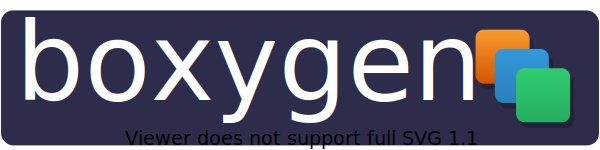

	
	 
	
	
	
	

Boxygen is a container as code framework that allows you to build container images from code, allowing integration of container image builds into other tooling such as servers or CLI tooling.

## SDKs

 - [Node](https://github.com/nitrictech/boxygen-node)

> If you have any requests for language support please raise an issue. (contributions are also welcome)

## Supported Backends

| Backend    | Status            | Description                                        |
| ---------- | ----------------- | -------------------------------------------------- |
| Dockerfile | 🧪 (Experimental) | Generates dockerfiles and executes build on commit |

### Possible backends

The current Dockerfile generator backend works, there is potential for supporting additional backends though depending on demand/appetite. The current gRPC contract should be compatible with:

- Containerfile generator
- Buildah
- Buildkit

If you'd like to see an additional backend or support for other methods of execution in the current Dockerfile generator e.g. `podman` or `buildah bud` raise an issue or a PR :).
